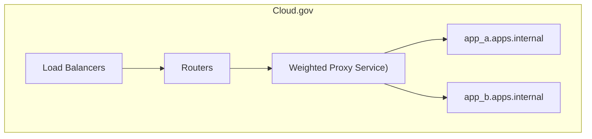

# Sample app

This is a sample application written in Go used for training purposes.

## Demonstrating A/B Testing

1. Show two apps pushed to the same route, that differ only in their env variable:

```
git checkout tags/works-w-simple-routing
# update manifests to have non-conflictint routes
for i in a_manifest.yml b_manifest.yml ; do cf push -f $i; done
```

Reload route and you'll see the apps getting cycles.

Problem: These are balanced 50/50. Also, no session persisten

2. Use a proxy 


cf add-network-policy pb-ab-test sample-app-a --protocol tcp --port 8080-8443
cf add-network-policy pb-ab-test sample-app-b --protocol tcp --port 8080-8443


cf network-policies | awk 'f;/source/{f=1}' | awk '{printf "cf remove-network-policy %s %s --protocol %s --port %s\n", $1, $2, $3, $4}'

# README

This project demonstrates hosting a private intranet application on cloud.gov using Cloud Foundry's Route Service feature.



## Requirements

Install and log into the [Cloud Foundry CLI](https://docs.cloudfoundry.org/cf-cli/install-go-cli.html).
